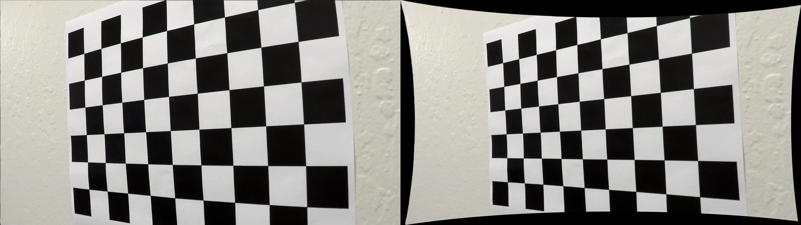
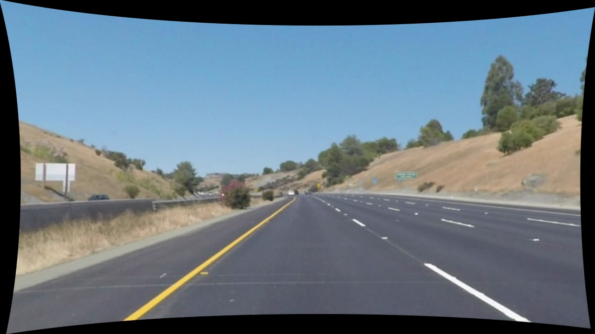
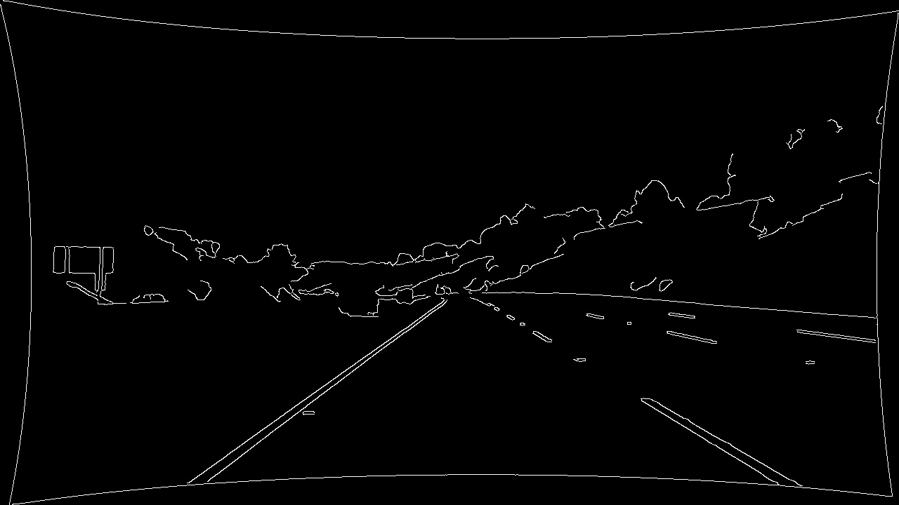
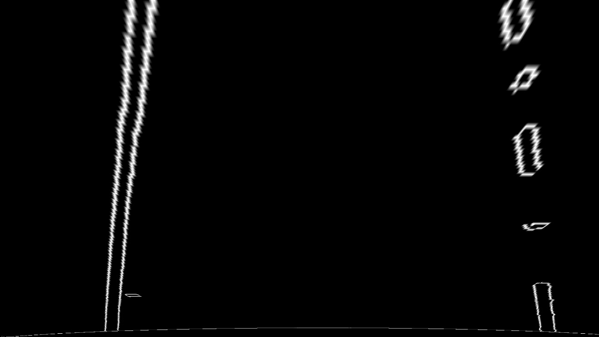
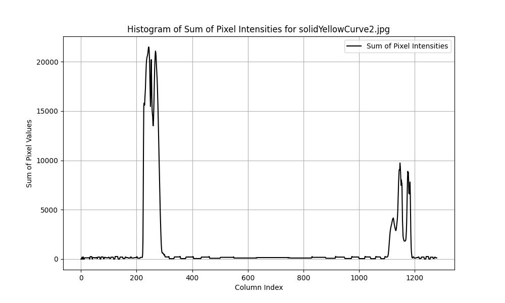
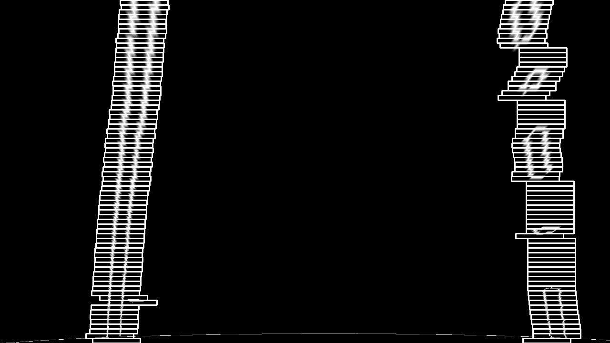
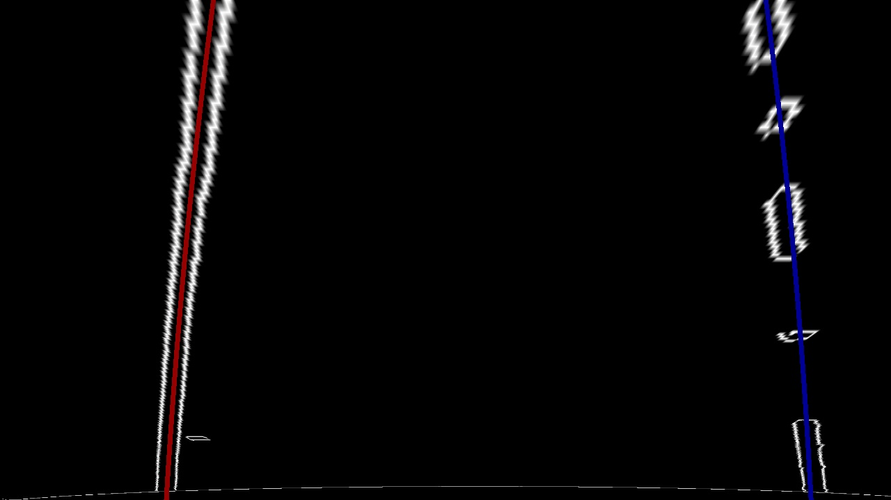
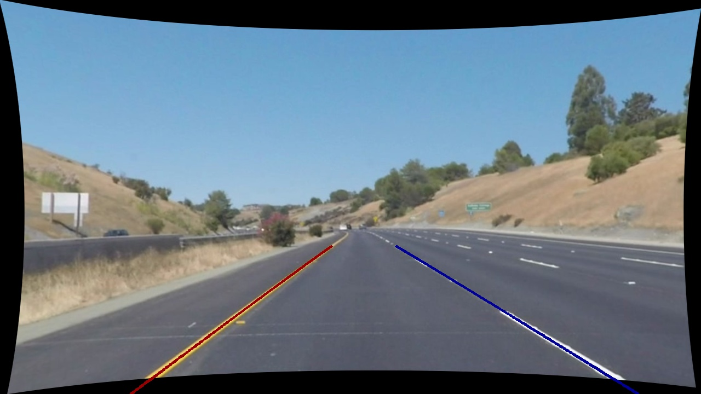
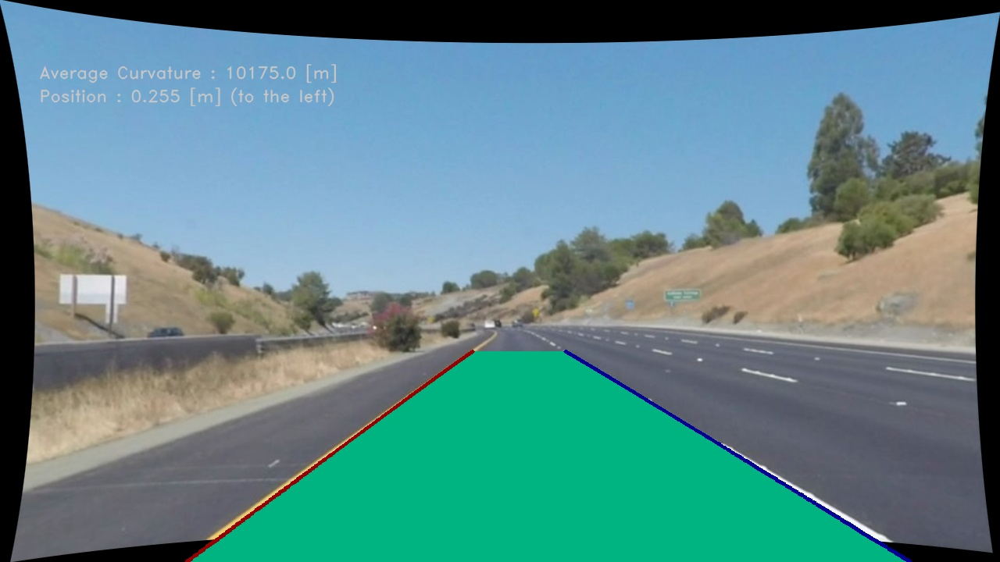

**LANE FINDING PROJECT**

The goals / steps of this project are the following:

* Compute the camera calibration matrix and distortion coefficients given a set of chessboard images.
* Apply a distortion correction to raw images.
* Use color transforms, gradients, etc., to create a thresholded binary image.
* Apply a perspective transform to rectify binary image ("birds-eye view").
* Detect lane pixels and fit to find the lane boundary.
* Determine the curvature of the lane and vehicle position with respect to center.
* Warp the detected lane boundaries back onto the original image.
* Output visual display of the lane boundaries and numerical estimation of lane curvature and vehicle position.

---

### Camera Calibration

#### 1. Briefly state how you computed the camera matrix and distortion coefficients. Provide an example of a distortion corrected calibration image.

Geometric camera calibration is a process in which parameters of a lens and image sensor of an image or video camera are estimated. Usually cameras distort the image, which makes the image unreliable to measure real life measures that are shown in the image. 
To combat this, first we take a set of sample images that have a pattern such as chessboard (makes it easy to find 2D coordinates), find the 3D real world points (object points) and the corresponding 2D coordinates of these points in the image (image points). These values are then used in the calibration process, that assumes a pinhole camera model. In this model, a 3D point in the world coordinate system is projected onto the 2D image plane by a simple linear transformation. The output values of camera calibration are: Camera matrix, Distortion coefficients, Rotation vectors, Translation vectors. This step should be done only one time, after that the values are saved in calib.npz.

***FIND IN CODE     Functions/CameraCalibration.py:  run_chessboard_calibration() [43-83]***

Distortion correction of an image is done by taking a distorted image, computing a new optimal camera matrix with distortion coefficients, and then undistorting the image with original camera matrix, distortion coefficients and new camera matrix. 

***FIND IN CODE     Functions/CameraCalibration.py:  distortion_correction() [5-40]***

The camera calibration and image distortion correction can be tested with the given command:   <ins>python calibration_main.py</ins>

***FIND IN CODE     calibration_main.py:  main [4-21]***

### Pipeline (single images)

The image pipeline can be tested with the given command:   <ins>python image_pipeline_main.py</ins>

#### 1. Provide an example of a distortion-corrected image.

First step in the pipeline is to correct distortion of an original image. This way image is more representative of the real life measures. It is done by calling the function for it.

***FIND IN CODE     image_pipeline_main.py:  # 1. Distortion correction [15-16] FIND IN CODE     Functions/CameraCalibration.py:  distortion_correction() [5-40]***

#### 2. Describe how (and identify where in your code) you used color transforms, gradients or other methods to create a thresholded binary image. Provide an example of a binary image result.

Second step in the pipeline is to single out object of interest in the image, which is in this case white and yellow lines on the road. The chosen method is to use Canny egde detection algorithm, since it is good at identifying and extracting the edges of objects within an image. To prepare the image for the algorithm, the image is converted to grayscale, and gaussian blur is used to reduce noise.

***FIND IN CODE     image_pipeline_main.py:  # 2. Thresholded binary image [18-19] FIND IN CODE     Functions/ImageProcessing.py:  image_thresholding() [4-29]***

#### 3. Describe how (and identify where in your code) you performed a perspective transform and provide an example of a transformed image.

Third step in the pipeline is to perform perspective transformation, so to make it easier to visualize the two parallel lines and their curvature. Good way to do this is to select an area of interest that has the lane markings and transform it into birds-eye perspective.

***FIND IN CODE     image_pipeline_main.py:  # 3. Perspective transformation [21-22] FIND IN CODE     Functions/ImageProcessing.py:  image_perspective() [32-64]***

#### 4. Describe how (and identify where in your code) you identified lane-line pixels and fit their positions with a polynomial?

Fourth step in the pipeline is to identify lane-line pixels in the image, so that we have actual coordinates of the lane on the image. We start by making a histogram of the birds-eye image, where the left and right lanes should show up as two peaks.

Out of that we get the coordinates of the left and right peaks, that we use as starting points for finding lanes on the birds-eye image. The sliding window technique is then used to iterate through the image, from bottom to top. For every window, contours (edges) are found, and for every contour, moments are calculated. With that, parts of lanes are found and saved as coordinates (X, Y) for both left and right.

***FIND IN CODE     image_pipeline_main.py:  # 4.1. Identify lane-line pixels [24-25] FIND IN CODE     Functions/LaneIdentifying.py:  lane_identifying() [4-72]***

After that, found coordinates for left and right are used to calculate polynomial values (y = A*x^2 + B*x + C), so that we can get values of a continuous line, rather then array of dots. In that way, it resembles more of a lane-line. 

The coordinates are then transformed from the birds-eye perspective to the original perspective and drawn into the original image.

***FIND IN CODE     image_pipeline_main.py:  # 4.2. Fitting the polynomial [27-28] FIND IN CODE     Functions/PolynomialFitting.py:  fit_polynomial() [4-72]***

#### 5. Describe how (and identify where in your code) you calculated the radius of curvature of the lane and the position of the vehicle with respect to center.

Radius of curvature is calculated using the **R = (1 + (2*A*x + B)^2)^3/2 / |2*A|** equation. A and B are coefficients of the polynomial that was calculated, x is the current position of the vehicle. There is also an added value that shows the scale of meters per pixel. Radius of left and right lane-line are used to find radius of a center line of the lane.

***FIND IN CODE     image_pipeline_main.py:  # 5. Determine curvature and vehicle position [31] FIND IN CODE     Functions/VehicleCalculations.py:  radius_of_curvature() [4-28]***

Position of the lane-lines are calculated using the **y = A*x^2 + B*x + C** equation. A, B and C are coefficients of the polynomial that was calculated, x is the current position of the vehicle. It is assumed that the vehicle is placed in the center of the picture, and position of the vehicle is calculated with respect to the center between the two lane-lines. There is also added values that shows the scale of meters per pixel (3.7 m is the averige size of an american lane).

***FIND IN CODE     image_pipeline_main.py:  # 5. Determine curvature and vehicle position [32] FIND IN CODE     Functions/VehicleCalculations.py:  vehicle_position() [31-64]***

#### 6. Provide an example image of your result plotted back down onto the road such that the lane area is identified clearly.

Onto an undistorted input image, radius of curvature, vehicle position, lane-lines, lane area (if the fill in the function fit_polynomial() is True) are plotted. Results of the example image are saved in the output/ file, as well as some other example images in different phases of the pipeline. 

***FIND IN CODE     image_pipeline_main.py:  # 6. Example image [34-36]***

### Pipeline (video)

#### 1. Provide a link to your final video output. Your pipeline should perform reasonably well on the entire project video (wobbly lines are ok but no catastrophic failures that would cause the car to drive off the road!).

The image pipeline can be tested with the given command:   <ins>python video_pipeline_main.py</ins>

Lane finding on the video is done same as the image, just that every frame is analized separately.

***FIND IN CODE     video_pipeline_main.py:  main [4-59]***

Link to video project_video01:  
Link to video project_video02:  
Link to video project_video03:  

### Discussion

#### 1. Briefly discuss any problems / issues you faced in your implementation of this project. Where will your pipeline likely fail? What could you do to make it more robust?

Failures in the pipeline:

Thresholded binary image - the image thresholding is very simple, with just transformation to gray, gaussian blur and canny. It works most of the time, but on images where the road is very light, canny loses the lane-lines, usualy the yellow one. To fix this, different thresholding can be done to the image, such as first masking the yellow and white color, so that they are not lost. Also some other method can be tried rather then canny.

Perspective transformation - in the perspective transformation, region of interest is handpicked with coordinates. It is a method that works since the road is usualy at the expected place on the image, but when the road changes altitude or there is a charp turn, it can go out of the region of interest. To fix this, region of interest can be found dynamically, rather then being static.

Identifing lane-line pixels - the sliding window technique works well since the window size is small. However, on the video format it would be better if there was some type of history, so that the next lane-line pixels were determined with the older ones in mind. Since the road is continuous, the next frame should be similar to the previous one, rather than having a completely different lane-line. That would also help if there was no lane-line detected, rather then having no lane-line, the older one could be used until the new one is found.

Determine curvature and vehicle position - in the calculations, vehicle current position and meters per pixel are just assumed. The calculation would be more precise if the real values were given. 

Draw the polynomial line - couldn't make the fill of the area transparent, since the images wouldn't take the alpha channel value. Also only end points of the lines were used for filling in the shape, rather then the whole line. 